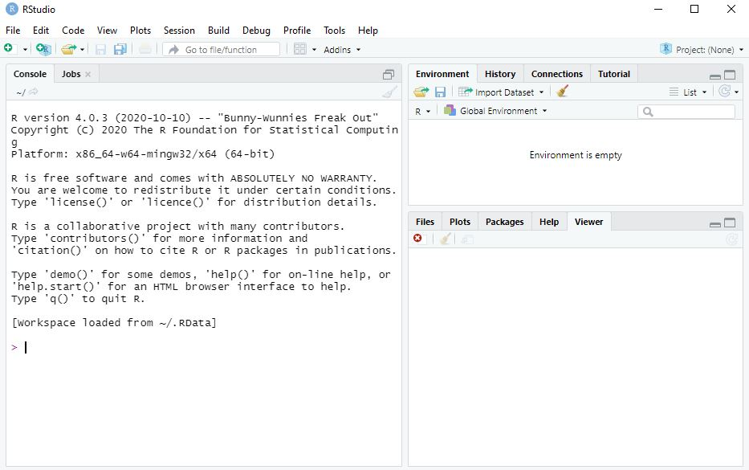
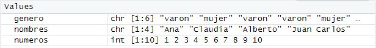

# Primeros pasos en R 

Abramos RStudio para familiarizarnos que con el entorno, lo más probable es que nos encontremos con algo similar a esto:

```{r echo=FALSE}

```

Aquí vemos tres ventanas: a la izquierda **la consola** y a la derecha una ventana que dice **ambiente (environment)** arriba y **los visores** abajo.

La consola es nuestra comunicación más directa con R, cada línea que escribimos es leído por el programa como una solicitud y es ejecutado (y se devuelve el resultado) inmediatamente después de que presionamos "enter"


Hagamos algunas pruebas:

## Consola

1. Escribamos en la consola algunas operaciones matemáticas (escribamos cada linea y damos enter para que nos devuelva el resultado)

Sumemos y restemos por ejemplo:

`25+5`

`56-3`

Podemos hacer multiplicaciones y divisiones

`5*5` (para las multiplicaciones)

`25/5` (para las divisiones)

2. Probemos ahora algo mas interesante:

Preguntemosle a R si 25 es mayor que 50, para eso escribamos en la consola

`25>50`

O si 25 es exactamente igual a 5 por 5

`25==(5*5)`

En estos ejercicios hemos usado una notacion particular para _pedirle cosas a R_, un breve resumen de esa **sintaxis** pueden verla en el siguiente enlace:
https://www.statmethods.net/management/operators.html

Prestemos atencion al segundo ejercicio, en estos ejercicios R nos devolvió un tipo de información distinta de la numérica, en este caso verdadero o falso (estas preguntas que hicimos se llaman **operadores lógicos** y devuelven este tipo de resultados)

3. Hagamos algo más complicado, escribamos lo siguiente y veamos que pasa:


```{r eval=FALSE}
set.seed(123)
ejemplo <- rnorm(n = 1000, mean = 2, sd = 35)
hist(ejemplo, col='grey', breaks=40, 
     ylab = "Frecuencia", main = "Nuestro primer histograma")
```

Seguramente lo que obtenemos es algo así: 

```{r echo=FALSE}
knitr::include_graphics("img/Rstudiofig2.JPG")
```

Bueno creamos un histograma repasemos un poco lo que obtuvimos, esta vez el resultado no es presentado en la consola sino en el **visor** esto ocurre porque el resultado es un **render**.

Render es una palabra en inglés que vamos a utilizar para toda transformación de resultados en un contenido multimedia.

Si observamos la ventana de *ambiente* vemos que apareció algo llamado ejemplo esto es un **objeto** que creamos con el código que usamos; en la siguiente sección hablaremos de los objetos. _Recordemos que R es un lenguaje "orientado a objetos" así que estos son clave en el proceso_

## Scripts

Si bien podemos trabajar comodamente en la consola esta conlleva algunas desventajas. En la consola no podemos editar nuestro código (cambiar o corregir aspectos) sin volver a escribirlo y no podemos guardarlo.
Para ello es que vamos a trabajar con scripts, archivos que podemos guardar, que se pueden volver a ejecutar y que sólo se ejecutan si nosotros lo solicitamos

### Crear un script

Para crear un script debemos utilizar el menu desplegable `File` y seleccionar `New file` y ahi `R script`

Esto nos dará una configuración así:

```{r echo=FALSE}
knitr::include_graphics("img/Rstudiofig3.JPG")
```

Ahora tenemos un esquema en 4 ventanas, vamos a repasar que son y paraque las vamos a utilizar:

- **Script**: arriba y a la izquierda es donde escribiremos los comandos, funciona como un editor de texto. RStudio para hacernos la tarea más fácil tiene un texto predictivo que nos sugiere las funciones a medida que las usemos. Nuestros comandos solo se ejecutaran si presionamos el botón `run` (en la misma ventana) o si presionamos `Ctrl`+``Enter`, sólo se ejecutaran las líneas que seleccionemos (que se seleccionan como si fueran un editor de texto)
- **Environment**: el ambiente de trabajo, aquí nos mostrarà que objetos existen y podemos manipular -aquì apareceran por ejemplo las bases de datos con las que trabajemos
-  **Consola**: la consola sigue habilitada para escribir pero (como vimos que esto no es muy cómodo) vamos a dejar que el script le pida cosas a la consola cada vez que lo ejecutemos, de ahora en más la consola _sólo nos mostrará los resultados que sean sólo números o texto (y también las advertencias o mensajes de error que tenga para informarnos)
-  **Visor**: en el visor aparecerán todos los contenidos multimedia que genere (los renders), hay botones en el visor que nos permitirá exportar estas imagenes o editarlas

## Objetos

Como repetimos varias veces **R es un lenguaje orientado a objetos.** 
Los objetos en si son como contenedores, en donde se puede alojar un valor aislado, o una lista de valores por ejemplo. 
La clave de ello es que en R podemos manipular ese objeto y con ello todo su contenido. Los objetos se manipulan a través de **funciones** 

### Creación de objetos

Vamos a crear algunos objetos, corramos los siguientes comandos en R: 

```{r eval=FALSE}

#Creamos el objeto a

a<-5

#El objeto a ahora debería aparecer en el Environment
#Si queremos ver el contenido del objeto hay tres opciones:

#1. lo muestra en la consola
a 
#2. le aplica una función "imprimir en la consola" a todo el objeto a
print(a) 
#3. la tercer opcion es hacer doble clic en el objeto en el Environment

```


><i class="fa fa-paperclip" aria-hidden="true"></i> **Aclaración**: El código presentado después de **#** se llama **comentario**, no se ejecuta y no es necesario escribirlo. Simplemente son notas que a veces dejamos para entender o aclarar algo del código.
>Tambien podemos usar **#** para inahbilitar temporalmente algunas lìneas del código (es muy útil cuando buscamos errores)


Habrá notado que para crear un objeto basta con ponerle un nombre (alfanumerico sin espacios) y asignarle un contenido. Para asignarle un contenido usamos el operador **asiganción** o sea `<-`. Este símbolo puedecambiar de dirección: `<-` o `->`. _Siempre la flecha va de contenido al nombre del objeto_, siguiendo esta regla:

`nombre_del_objeto <- valor_del_objeto`


#### <i class="fa fa-wrench" aria-hidden="true"></i> Ejercicios

Hasta ahora hemos creado objetos de un solo contenido, vamos a crear objetos con contenidos mas diversos. Escribamos el siguiente codigo en R

```{r}
#Crea un objeto con numeros del uno al 10
numeros<-1:10

#Crea un objeto que contiene una lista de nombres
nombres<-c("Ismael", "Claudia", "Alberto", "Juan Carlos", "Laura", "José", "Luis", "Lorena", "Charly", "Fito")

#Creemos un objeto que contenga la lista del genero 
#de los primeros  alumnos del curso

genero<-c("varon", "mujer","varon","varon", "mujer","varon", "varon", "mujer","varon","varon")


##Ahora imprimamoslo para ver su contenido

print(numeros)
print(nombres)
print(genero)
```

Vamos a aclarar algunos conceptos de la sintaxis: 

1. Usamos `:` entre dos numeros para decirle a R que nos de todos los numeros en ese rango inclusive los extremos. 
2. Cuando creamos objetos llenos de texto, como los nombres o el genero, R no entiende de palabras entonces debemos aclararlo para eso los escribimos entre `""`. Esto dice a R donde empieza y termina una palabra y que es sólo eso (porque a veces las palabras son objetos o funciones, pero entre comillas es solo una palabra). Si queremos incluir una enumeracion de palabras o de objetos de distinta clase debemos usar la sintaxis `c(contenido1, contenido2, contenido3)`

### Clases de objetos
Veamos después de nuestro ejercicio que pasó en el Environment, seguro tenemos algo así:


```{r echo=FALSE}

```


Vemos que aparecen nuestros objetos, seguidos por tres letras que hablan de la **clase** a la que pertenece (tranquilos que hablaremos de ello más adelante), después vemos dos numeros entre corchetes, estos son la **dimensión** de nuestro objeto. 

Para R los objetos son **matrices**, es decir distribuciones en dos dimensiones (como filas y columnas) de los contenidos, que en matrices se dice _n x m_. N tradicionalmente habla de el numero de filas y m del numero de columnas. 

Para una revisión de lo que es una matriz pueden visitar https://es.wikipedia.org/wiki/Matriz_(matem%C3%A1ticas)

Esta forma de entender los datos es muy útil porque las bases de datos son (en definitiva) matrices con contenido numerico o algebraico.

Volviendo a la ventana de R, nuestros objetos son descriptos como [1:6] o [1:10], eso quiere decir que son matrices con una sola fila. A este tipo especial de matrices lo llamamos **vectores**.

Pese a que estemos en los primeros pasos y todo parezca muy abstracto hagamos un ejercicio de extrapolación, nuestros vectores (matrices de una sola dimension) pueden funcionar como columnas de una bazse de datos y la base de datos una matriz mas grande que se forma mezclando los vectores. Sí suena muy loco, pero confiemos que se va a ir aclarando. 

Los vectores pueden tener distinto contenido, la **clase** de un vector es definida por su contenido. En reglas generales los vectores pueden adoptar la siguientes clases:
R tiene cinco clases básicas de vectores:

  - character (letras)
  - numeric (números enteros unicamente)
  - integer (números reales, o sea con decimales)
  - complex (números complejos)
  - logical (verdadero/falso o True/False)
  
  Si queremos ver de que clase es un objeto podemos aplicarle la función `class()`
  
  Hagamos el ejercicio con nuestros objetos:
  
```{r}
class(numeros)
class(nombres)
class(genero)
```

Presten atención que el nombre de los objetos **NO** llevan comillas porque queremos que R entienda que es el objeto números y no la palabra "números" por ejemplo

Desafío:
Corran los siguientes comandos en su script

`print(numeros)`

`print("numeros")`

¿Notan la diferencia de resultados? Prepárense para explicar en clase por qué


```{r}
#Los objetos pueden tener contendio mixto pero reciben la clase del tipo menos informativo que contengan por ejemplo:

mixto<-c("Ismael", 1, 1.33)

#Este es un objeto con contenido numeric, integer y character

class(mixto)
```

Lo que hemos hecho recién es aplicar intuitivamente una **función** a un objeto. Este sencillo acto es la mayor complejidad que tiene R, todo, todo se trata de esto


Existe un 6to. tipo de vectores que nos serán muy pero muy útil, el **factor**. Los factores son grupos de datos categóricos (son palabras para R) pero que albergam un orden intrínseco: "Grande", "mediano" y "chico", por ejemplo. Para crearlos no basta informarle a R su contenido, sino que tambien hay que indicar el orden de jerarquia de los valores

```{r}
#este objeto se crea con dos vectores, un vector con los valores de los alumnos y un vector con el orden de los niveles
altura_alumnos <- factor(c("alto", "bajo", "bajo", "mediano","bajo", "alto", "bajo", "bajo", "mediano","bajo"),
                       levels=c("bajo", "mediano", "alto"))

```

Si lo miramos en el environment:

```{r echo=FALSE}

```

Nos dice que es un factor que tiene tres niveles y vemos que al valor real de cada alumno lo convirtió en un número que representa el nivel.

Esto es muy útil porque mucho de nuestros datos pueden presentarse de esta forma


### Operaciones con objetos

Los objetos se pueden manipular con operaciones como hemos visto previamente, tengan uno o muchos elementos

```{r}
#Quiero dividir todos los elementos del vector numeros a la mitad

numeros/2
```
```{r}
# Si quisieramos usar esta lista que hemos obtenido ahora màs adelante la podemos asignar a otro objeto

numeros_divididos<-numeros/2

#Fijense que ahora existe en el environment
print(numeros_divididos)
```


```{r}
#podemos hacer muchas cosas con los operadores, como operaciones complejas

(numeros/2)+1


#ahora a cada componente lo dividimos por la mitad y le sumamos uno
```

También podemos hacer operaciones con vectores de palabras.

```{r}


#queremos saber si el contenido de la lista genero es varon por ejemplo

genero == "varon"

# Ahora obtuvimos un vector del tipo "lógico" porque aplicamos un operador logico y este es su resultado

```
```{r}

#Un dato relevante es que la clase True o False puede usarse en operaciones numericas (True es igual a 1 y False es igual a 0), por eso a este vector logico podemos sumarle 1
genero_TF<-genero == "varon"
class(genero_TF)
```
```{r}
genero_TF+1
```


### Funciones con objetos 
A los objetos se les pueden aplicar funciones (intuitivamente ya hemos usado `class()` y `print()`). El numero de funciones es enorme, veamos algunos ejemplos.

```{r}
#queremos contar el numero de elementos que hay en el objeto genero

length(genero)

#esta funcion nos da el "largo" del vector, es decir el numero maximo de elementos
```


```{r}
#tambien existen funciones para "cambiar" la clase de un objeto
#supongamos que queremos que al leer el vector número, R no lo entienda como numeros sino como palabras

numeros_como_palabras<-as.character(numeros)

class(numeros_como_palabras)

```

```{r eval=FALSE}

#Probemos ejecutar el siguiente comando 

numeros_como_palabras+1
```

El resultado es algo así

Error in numeros_como_palabras + 1 : 
  non-numeric argument to binary operator
  
```{r}
#pero en este caso podemos revertir el rpoblema con una funcion

numeros_como_palabras<-as.numeric(numeros_como_palabras)

#notese que asignamos un objeto transformado al mismo objeto, esta operacion "sobrescribe el objeto", no es aconsejable porque es irreversible (aqui la usamos para no generar miles de objetos)

class(numeros_como_palabras)
```
```{r}
#ahora no hay problema con la suma

numeros_como_palabras+1
```
```{r}
#estas funciones de asignacion de clase no siempre se pueden usar, no podemos convertir los nombres en numeros porque no conocemos a que numero asignarlos por ejemplo

nombres_como_numeros<-as.numeric(nombres)

#nos da un mensaje de error, veamos que pasó
```
```{r}
#la clase se asignó
class(nombres_como_numeros)
```
```{r}
#pero los objetos no pudieron convertirse, entonces se convirtieron en NA, que es el equivalente a un valor perdido

print(nombres_como_numeros)
```


```{r}
#si queremos calcular por ejemplo la media de nuestro vector números

mean(numeros)

```
```{r}
#O el Desvío estándard por ejemplo

sd(numeros)
```


FELICITACIONES HA HECHO SU PRIMER ANÁLISIS DE ESTADÍSTICA DESCRIPTIVA EN R<i class="fa fa-hand-peace-o" aria-hidden="true"></i>

## <i class="fa fa-wrench" aria-hidden="true"></i> Ejercicio integrador

Continuemos con nuestro esfuerzo de abstracción y volvamos a pensar en las bases de datos como matrices.

Una columna de una variable es entonces un vector, y los valores que adopta en cada sujeto sus componentes.

1. ¿Que clase de vector serían las siguientes variables:?

> **Tipo de variables**_______________**Clase del vector**
>
>Variable continua
>
>Variables dicotómica
>
>Variable ordinal 
>
>Variable categorica          


2. Ahora apliquemos lo aprendido a conceptos de "la vida real", dados estos ejemplos de variables trate de clasificarlos con la definición teórica y en la clase de vector que se transformaría

> **Tipo de variables**__________**Tipo de variable**__________**Clase del vector**
>
>Edad (en años)
>
>Sexo
>
>Nota de un examen 
>
>Temperatura corporal de un castor (ºC)
>
>Coeficiente de inteligencia (IQ)
>
>Color de ojos
>
>Ocurrencia de un evento o no
>
>Medalla olimpica obtenida
>
>Estrellas en mercado libre 

Recuerden un principio esencial en la operacionalización de las variables: 

```{r echo=FALSE}

```

Las variables pueden cambiar de categoría si decidimos "verlas" de una forma u otra, pero esto afecta a la forma que se las "trata" (la clase que R les asigna y eso determina que operaciones podemos hacer con ellas)


## Dataset-Dataframe, bases de datos


Bueno ha llegado el momento de dejar los cielos de la abstracción y pasar de los vectores y las matrices a las bases de datos. 

En esta sección vamos a ver como podemos construir un conjunto de datos a partir de objetos.

Si bien existen sutiles diferencias en los términos dataset y dataframe son dos términos sinónimos a los efectos de este curso y hablan de un conjunto de datos que podemos manipular en R

Recordemos que tenemos nuestros objetos previamente creados

```{r}
genero

nombres

numeros

##Si ya no los tienen en su ambiente, vuelvan a correr el código donde los creamos anteriormente

```

Vamos a crear un nuevo objeto vector que va a contener numeros al azar entre 0 y 10 

```{r}
set.seed(123) 
##usamos este comando para que (pese a que se haga al azar) todos podamos obtener el mismo resultado

peso_alumnos <- runif(n=10, min=50, max=100) 
#acá usamos una función para generar números aleatorios
#el primer valor es la cantidad de numeros, y los otros dos el minimo y el máximo

```

 


><i class="fa fa-paperclip" aria-hidden="true"></i> Todas las funciones necesitan información para trabajar, esa información agregada por el usuario se llaman **parámetros** y a la forma en que se cargan **argumento**. Cada función tiene sus propias reglas (pero generalmente son parecidas). A esto es lo que llamamos **sintaxis**. RStudio tiende a sugerirnos la sintaxis necesaria (prueben a ir escribiendo despacio la función y verán aparecer el predictivo)
Si no conocemos la sintaxis de una función podemos usar la función: `help()`
>
>Prueben a tipear `help(runif)` y veran un documento detallado sobre como utilizarla


### Creación de base de datos:

Vamos a ver una nueva función que trabaja con vectores, la función `data.frame()`.
Apliquemosla a nuestros objetos de la siguiente manera:

```{r}
mi_primera_base<-data.frame(numeros, nombres, genero, altura_alumnos, peso_alumnos)
```

FELICITACIONES CREAMOS UNA BASE DE DATOS A PUNTO DE PARTIDA DE UN CONJUNTO DE VECTORES

Para hacer esto usamos la función data.frame(), los _argumentos_ que esta función necesita es solamente el nombre de los vectores en el orden que lo queremos.

Veamos que pasó en el Enviroment:

```{r echo=FALSE}

```

Ahora tenemos por separado nuestra base, nos dice el numero de observaciones, que corresponde al largo de los vectores y el número de variables (que es el número de vectores que incluímos)

Si hacemos clic sobre el boton celeste con el signo play podemos ver la forma de la base.


### Funciones básicas para los dataframes

Exporemos algunas funciones que se pueden aplicar a este objeto. 
Vamos con la función querida función `class()`

```{r}
class(mi_primera_base)
```

Nuestra base es un obejto de R de la clase **dataframe**, esta es una clase de objeto especial que si bien como veníamos mencionando es como una matriz, esta tiene encabezados.

Probemos algunas funciones simples.


1. La función `head()`, nos muestra los primeros valores de la base

```{r}
head(mi_primera_base)
```

Por default nos muestra los primeros 6 elementos, pero podemos introducirle parámetros para modificarla


```{r}
head(mi_primera_base, 3)
```

El argumento que le agregamos es el número de filas que queremos que nos muestre.

Esta función es muy útil cuando queremos dar un vistazo preliminar a una base muy grande que tarda mucho tiempo en cargar.

2. La función `tail()` . Probemos otra similar para previsualizar la base de datos.

```{r}
tail(mi_primera_base)
```

Sin usar grandes poderes de deducción nos damos cuenta que muestra los últimos elementos de la base.


3. Veamos una función muy necesaria, la función `str()`:

```{r}
str(mi_primera_base)
```

Esta función es sencillamente genial, nos devuelve un panorama general de la base, el numero de observaciones, las variables y una descripción de la clase de cada vector que la compone.


4. Una función que siempre tiene que estar en nuestra caja de herramientas es la función `summary()`

```{r}
summary(mi_primera_base)
```
Esta función nos ha resuelto la tabla 1 de cualquier paper, si observan ha sacado estadísticos de resumen para variables continuas (numero y peso alumnos) y estadisticos de frecuencia para las variables nominales. Solo ha calculado el n de las variables que dejamos como "palabras" porque no le asignamos una mejor clase.

Como ven aquí se hace muy clara la necesidad de asignar la mejor clase posible a la variable para que R la trate apropiadamente.


Bueno como hemos visto, es posible crear una base desde la creación de vectores.Cómo todos estarán pensando,  la toma de datos y la construcción de una base de esta forma es muy engorrosa, y lo es.

De ahora en mas vamos a trabajar utilizando bases de datos creadas en otros programas como Excel. 

```{r echo=FALSE}
knitr::include_graphics("img/pollilla.jpg")
```

## <i class="fa fa-wrench" aria-hidden="true"></i> Ejercicio integrador

Vamos a cerrar esta unidad armando nuestro propio diccionario de funciones. Describa que tareas realizan estas funciones 


> **DICCIONARIO DE FUNCIONES**
>
>print()
>
>class()
>
>as.numeric()
>
>as.character()
>
>is.numeric()
>
>is.logical()
>
>length()
>
>mean()
>
>sd()
>
>help()
>
>data.frame()
>
>head()
>
>tail()
>
>str()
>
>summary()


Hay algunas funciones que no figuran en el texto, pero usted tiene funciones que le ayudaran a resolver ese problema <i class="fa fa-smile-o" aria-hidden="true"></i>
